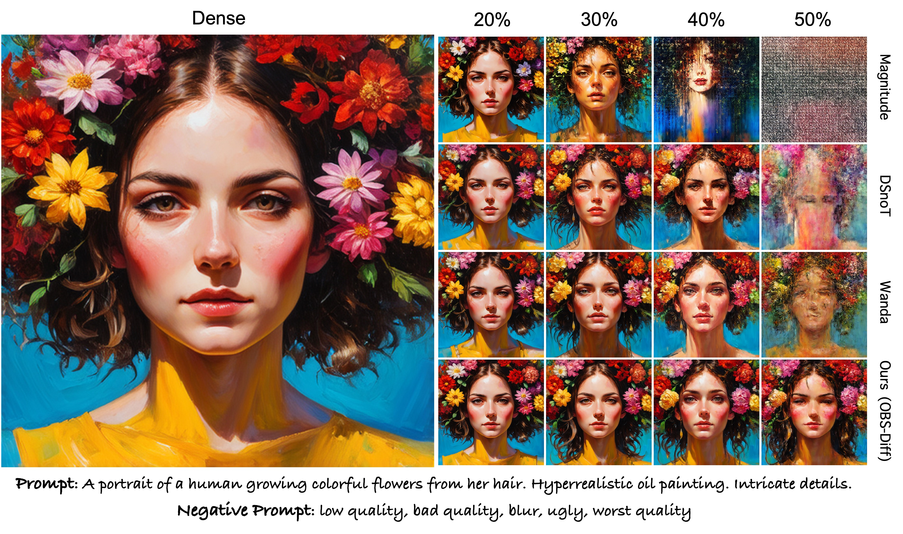
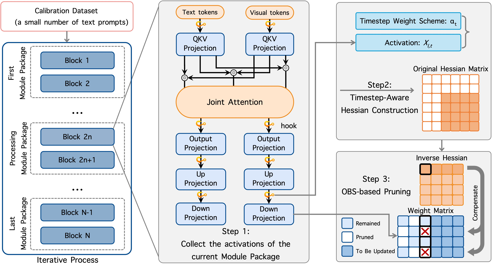
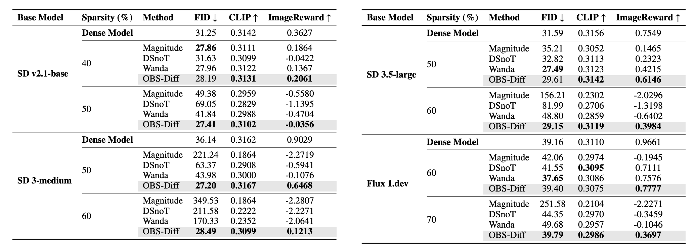
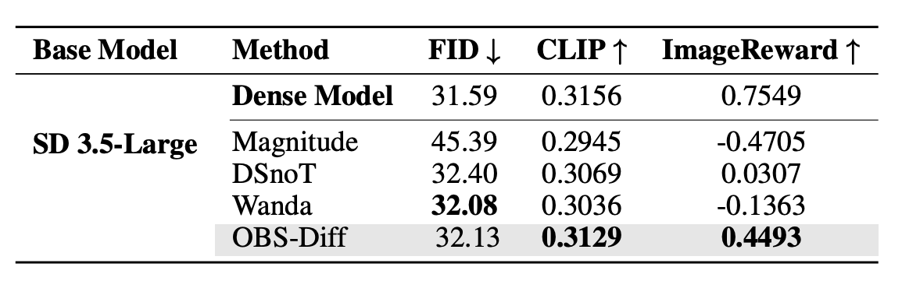
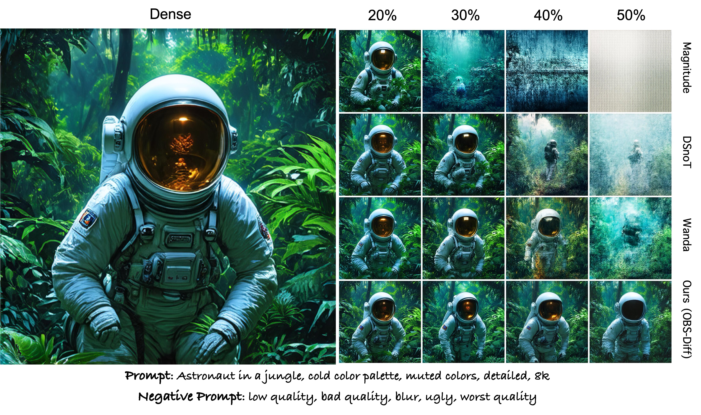
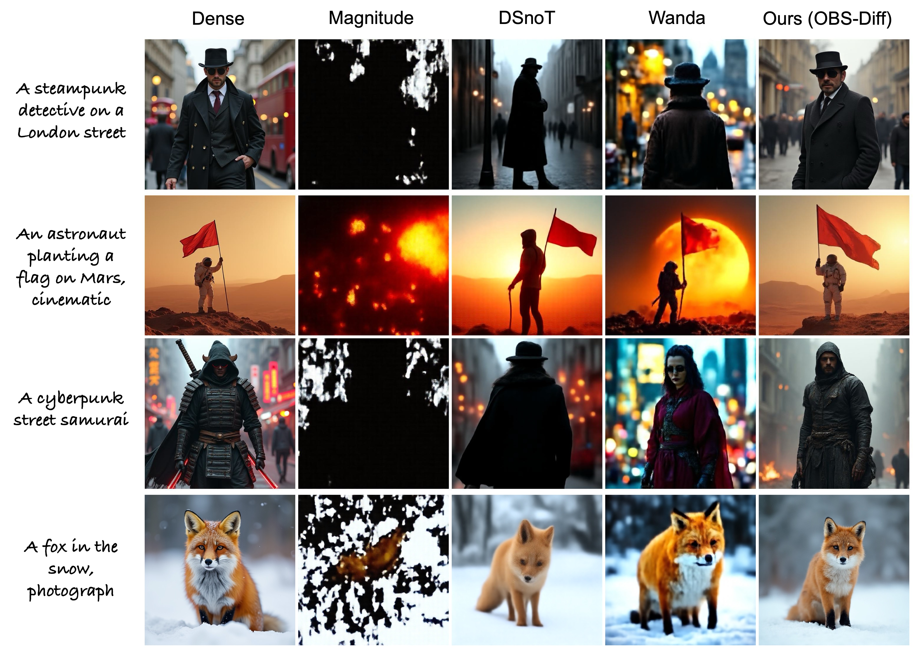
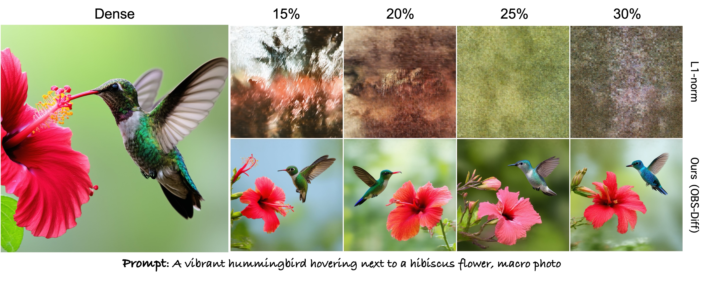

<div align="center">
<p align="center">
  
</p>

# OBS-Diff:<br> Accurate Pruning For Diffusion Models in One-Shot
<h3><font color="#8B0000">🎉 Accepted by ICLR 2026</font></h3>

<a href="https://arxiv.org/abs/2510.06751">

<a href="https://alrightlone.github.io/OBS-Diff-Webpage/">

<a href="https://opensource.org/licenses/Apache-2.0">

</a>


**[Junhan Zhu](https://alrightlone.github.io/)**<sup>1</sup>, **[Hesong Wang](https://viridisgreen.github.io/)**<sup>1,2</sup>, **[Mingluo Su](https://github.com/sunshine-0903)**<sup>1</sup>, **[Zefang Wang](https://github.com/aden9460)**<sup>1,2</sup>, **[Huan Wang](https://huanwang.tech/)**<sup>1*</sup>

<sup>1</sup>Westlake University, <sup>2</sup>Zhejiang University
<br>
*<sup>*</sup>Corresponding author: wanghuan [at] westlake [dot] edu [dot] cn*

</div>

<div align="left">
  
  <br>
  <em>Qualitative comparison of unstructured pruning methods on the SD3-Medium model. We evaluate Magnitude, DSnoT, Wanda, and our method (OBS-Diff) at various sparsity levels (20%, 30%, 40%, and 50%) using the same prompt and negative prompt. All images are generated at a resolution of 512 x 512.</em>
</div>

<br>


## 📰 News
* **[2026-01-26]** 🎉 **Accepted by ICLR 2026!** Let's talk about sparsity and efficiency in Brazil! 🇧🇷 
* **[2026-01-02]** 🤗 **Model Zoo Released!** We are excited to provide the pruned weights for [SDXL (10%~30%)](https://huggingface.co/Alrightlone/OBS-Diff-SDXL) and [SD3.5-Large (15%~30%)](https://huggingface.co/Alrightlone/OBS-Diff-SD3.5-Large)! 

  These models are achieved in a **totally training-free** and **one-shot** manner. 

* **[2025-10-09]** 🔥 **Paper & Code Available!** The official implementation and paper for **OBS-Diff** are released.

# Introduction
Large-scale text-to-image diffusion models, while powerful, suffer from prohibitive computational cost. Existing one-shot network pruning methods can hardly be directly applied to them due to the iterative denoising nature of diffusion models. To bridge the gap, this paper presents *OBS-Diff*, a novel one-shot pruning framework that enables accurate and training-free compression of large-scale text-to-image diffusion models. 

Specifically,

1. OBS-Diff revitalizes the classic Optimal Brain Surgeon (OBS), adapting it to the complex architectures of modern diffusion models and supporting diverse pruning granularity, including unstructured, N:M semi-structured, and structured (MHA heads and FFN neurons) sparsity;

 2. To align the pruning criteria with the iterative dynamics of the diffusion process, by examining the problem from an error-accumulation perspective, we propose a novel timestep-aware Hessian construction that incorporates a logarithmic-decrease weighting scheme, assigning greater importance to earlier timesteps to mitigate potential error accumulation; 
 3. Furthermore, a computationally efficient group-wise sequential pruning strategy is proposed to amortize the expensive calibration process. 
 
 Extensive experiments show that OBS-Diff achieves state-of-the-art one-shot pruning for diffusion models, delivering inference acceleration with minimal degradation in visual quality.

# Framework
<div align="left">
  
  <br>
  <em>Illustration of the proposed <i>OBS-Diff</i> framework applied to the MMDiT architecture. Target modules are first partitioned into a predefined number of <i>module packages</i> and processed sequentially. For each package, hooks capture layer activations during a forward pass with a calibration dataset. This data, combined with weights from a dedicated timestep weighting scheme, is used to construct Hessian matrices. These matrices guide the Optimal Brain Surgeon (OBS) algorithm to simultaneously prune all layers within the current package before proceeding to the next.</em>
</div>
<br>

# Some Quantitative Results
<div align="left">
  
  <br>
  <em>Quantitative comparison of unstructured pruning methods on text-to-image diffusion models. The best result per metric is highlighted in <b>bold</b>.</em>
</div>
<br>
<div align="left">
  
  <br>
  <em> Performance of semi-structured (2:4 sparsity pattern) pruning on the Stable Diffusion 3.5-Large model. Pruning is applied to the 3rd through 25th MMDiT blocks. The best result is shown in <b>bold</b>.</em>
</div>
<br>
<div align="left">
  
  <br>
  <em> Performance of structured pruning on the SDXL (U-Net) model across various sparsity levels. Comparison includes the L1-norm baseline, EcoDiff, and our proposed OBS-Diff. The TFLOPs metric represents the theoretical computational cost for a single forward pass of the entire UNet. For each sparsity group, the best result per metric is highlighted in <b>bold.</b></em>
</div>
<br>
<div align="left">
  
  <br>
  <em> Performance of structured pruning on the Stable Diffusion 3.5-Large model across various sparsity levels. The first and last transformer blocks were excluded from the pruning process. The TFLOPs metric represents the theoretical computational cost for a single forward pass of the entire transformer. For each sparsity group, the best result per metric is highlighted in <b>bold</b>.</em>
</div>
<br>


# Some Qualitative Results
<div align="left">
  
  <br>
  <em>Qualitative comparison of unstructured pruning methods on the SD3-Medium model. We evaluate Magnitude, DSnoT, Wanda, and our method (OBS-Diff) at various sparsity levels (20%, 30%, 40%, and 50%) using the same prompt and negative prompt. All images are generated at a resolution of 512 x 512.</em>
</div>
<br>
<div align="left">
  
  <br>
  <em>Qualitative comparison of unstructured pruning methods on Flux 1.dev at 70% sparsity. Results from Magnitude, DSnoT, Wanda, and our proposed OBS-Diff are shown.</em>
</div>
<br>
<div align="left">
  
  <br>
  <em> Qualitative comparison of structured pruning methods on the SD3.5-Large model at various sparsity levels (15%, 20%, 25%, and 30%). Results from the L1-norm baseline and our proposed OBS-Diff are shown.</em>
</div>
<br>

# Quick Start
## 1. Installation
First, install our codebase:

```bash
git clone https://github.com/alrightlone/OBS-Diff.git
cd OBS-Diff
```
Then, install the dependencies:
```bash
pip install -r requirements.txt
```
You need to install models (SD3-Medium) from [Hugging Face](https://huggingface.co/stabilityai/stable-diffusion-3-medium) and calibration dataset (GCC3M) from [Conceptual Caption 12M](https://ai.google.com/research/ConceptualCaptions/download).

## 2. Data Preprocessing
To prepare the calibration dataset, we utilize the GCC3M subset.
 Run the following script to format the raw data for the OBS-Diff pruning pipeline:
``` bash
python data/gcc3m_preprocessing.py
```
This step ensures the data is correctly tokenized and organized to facilitate accurate Hessian information estimation during the pruning process.

## 3. Usage

+ Unstructured Pruning For SD3-Medium
```bash
bash ./scripts/OBS_Diff_Unstructured.sh
```
+ N:M Semi-structured Pruning For SD3-Medium
```bash
bash ./scripts/OBS_Diff_Semi.sh
```
+ Structured Pruning For SD3-Medium
```bash
bash ./scripts/OBS_Diff_Structured.sh
```

> Note: You need to change the path to the models and calibration dataset in the scripts and codes.


# Contact

If you have any questions, please contact us at [zhujunhan@westlake.edu.cn](mailto:zhujunhan@westlake.edu.cn).

# Acknowledgments

We thank the following projects for their contributions to the development of OBS-Diff:
[SparseGPT](https://github.com/IST-DASLab/sparsegpt),
[Wanda](https://github.com/locuslab/wanda),
[DSnoT](https://github.com/zyxxmu/DSnoT),
[EcoDiff](https://github.com/YaNgZhAnG-V5/EcoDiff),
[SlimGPT](https://openreview.net/forum?id=MxF0IKJtKW&referrer=%5Bthe%20profile%20of%20Qingwen%20Liu%5D(%2Fprofile%3Fid%3D~Qingwen_Liu2)),
[DepGraph](https://github.com/VainF/Torch-Pruning),
[Diff-Pruning](https://github.com/VainF/Diff-Pruning).


# Citation
If you find this work useful, please consider citing:

```bibtex
@article{zhu2025obs,
  title={OBS-Diff: Accurate Pruning For Diffusion Models in One-Shot},
  author={Zhu, Junhan and Wang, Hesong and Su, Mingluo and Wang, Zefang and Wang, Huan},
  journal={arXiv preprint arXiv:2510.06751},
  year={2025}
}
```